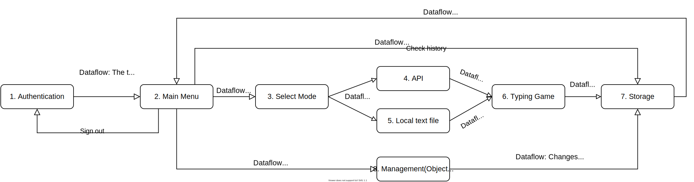
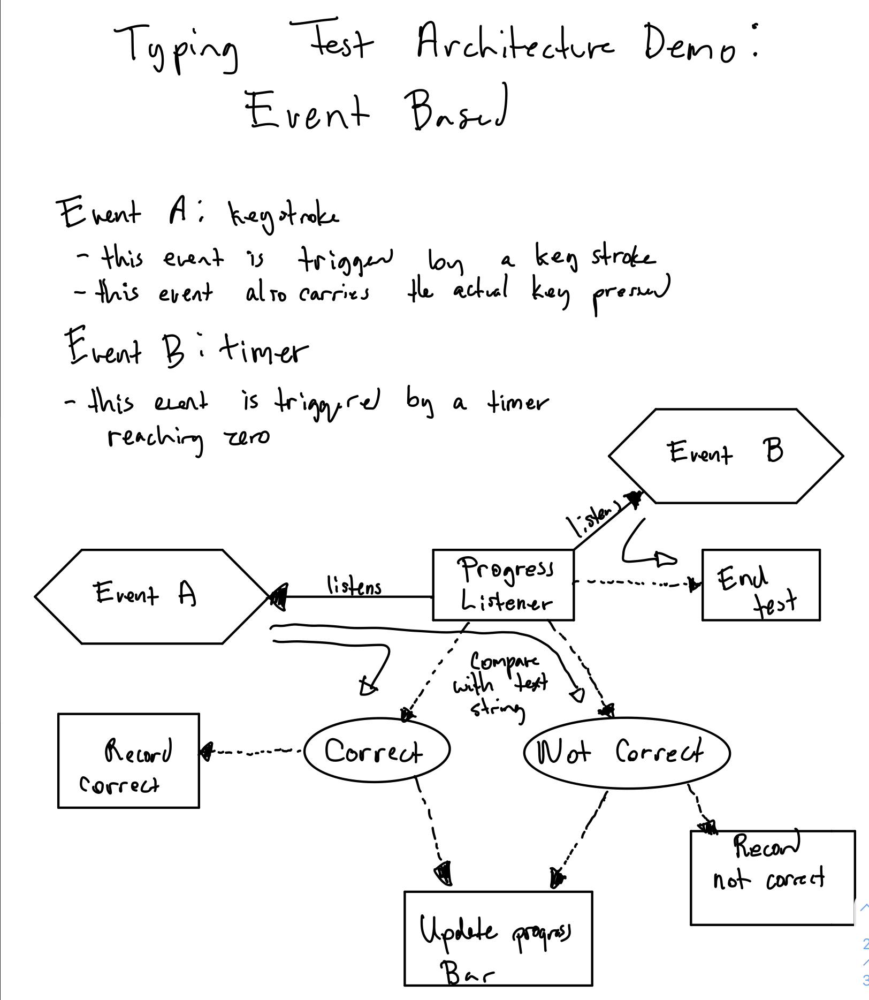
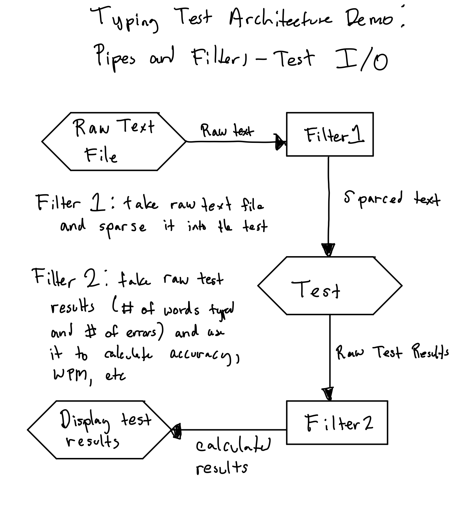
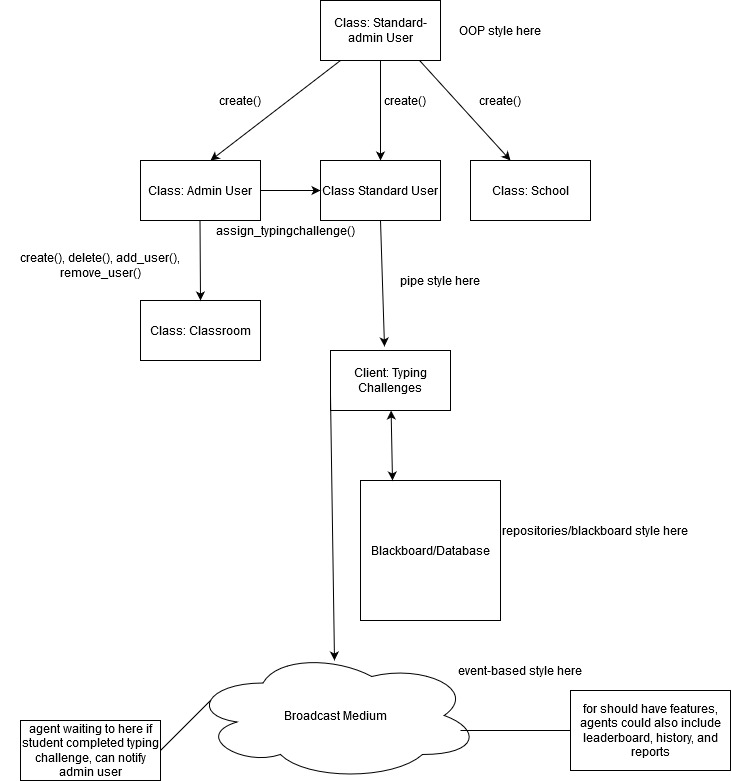

# Potential System Architecture Plans:

Plan No.1:

Plan No.2:

Description:
   - The plan is basically a pipe and filter architecture with an object-oriented organization encapsulated in it. The reason to select pipe and filter architecture is that there are lots of independent entities. For example, the API can only take request in and return the text back, the game interface can only take the text in and send the user's result to the storage, they do not need to know much about what the upstream or downstream filter does. I encapsulate an object-oriented organization for the management system because it's good to handle the relationship between different actors. (as I am still trying to figure out how to replace the object-oriented organization by a pipe and filter as Kawser suggested.

Components:
   1. Authentication 
      - The firebase sign-up and sign-in system
   2. Main Menu
   3. Select Mode 
      - The entrance to the typing game. The selection of mode will lead to different typing text being used. The mode selection could be either self-driven or picked by a task signed by a teacher.
   4. API
   5. Local text file
   6. Typing game
      - The game interface
   7. Storage
      - The database where the users' typing history being stored
   8. Management
      - An encapsulated object-oriented organization

Connectors:
   - as shown in the diagram

Constraints:
   1. If the user signs in as a standard user, the management function will be restricted.
   2. If the user doesn't have an internet connection, he can enter the game as a guest but he can only play the game with local text files, and the management, API and storage function will be restricted.

Plan No. 2

Description:
- The plan incorporates the styles of pipes and filters, OOP, repositories/blackboard, and event-based. (Will update)