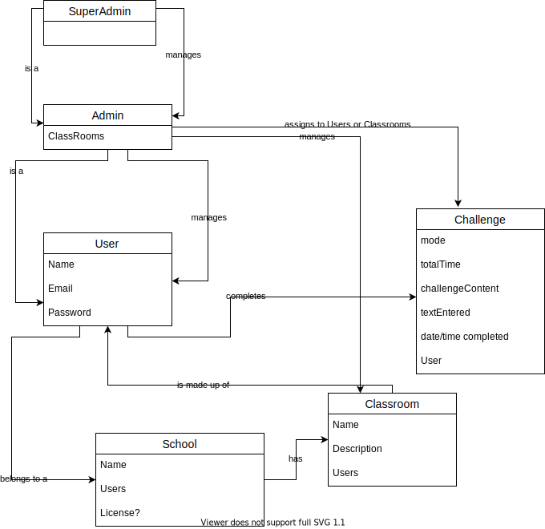

# Project Description
Word Flow is an application to train users to type faster and with greater accuracy. The focus is on unique uses not covered by other typing tools- special characters used by programming languages, and typing from audio content. It is designed with typing classes in a school environment in mind, and thus includes a hierarchical user management structure, based on a School having Classrooms.

Main functionality includes:
- Users can complete a variety of typing challenges and view their speed and accuracy for each challenge and see how they have improved over time.
- Admin users can create Classrooms of users, assign them challenges to complete, and view reports for these users.
- Super Admin users can create a School, invite users to join, and assign users to be managed to Admins.

The typing challenges will range from standard English words, to specific programming languages, and typing from audio dictation. It can check the user's input text against the challenge text, showing the user where they are in the text and if they have made any errors, and how long they have spent on the challenge. Once complete, they will see their speed and accuracy for the challenge.

The application is designed for desktop environments and created in the Python programming language. It utilizes the Firebase API for user and database management so that users can access their account information from different devices. Audio content for dictation mode may be generated from text or will be received from an external API (TBD) and played over device speakers. 

# Actors
The different actors that are able to perform specific tasks.

[Actors](/Requirements/Actors)

## Definitions
Definitions of terms commonly used throughout the project or project documentation.

[Definitions](/Requirements/Definitions)

# Requirements
Requirements of the software, separated into functional requirements of what users are able to do, and non-functional requirements, specifying how the software will be built and to what standard.

[Functional Requirements](/Requirements/Functional-Requirements)

[Non-Functional Requirements](/Requirements/Non-Functional-Requirements)

# Use Case Scenarios
Core functionality demonstrated through scenarios, and use cases specific to those scenarios.

[Use Cases Scenarios](/Requirements/Use-Case-Scenarios)

# Diagrams
## Use Case Diagrams

## Domain Model
This diagram is mainly to help visualize the relationship between different user types.

## Interface Sketching
Interface sketches for basic functionality. Controls are included to show functionality, but should not be assumed to be a final design (ie: a radio box is included to show that only one of multiple options can be selected, and may be replaced by a combo box, tabs, or another design element).
